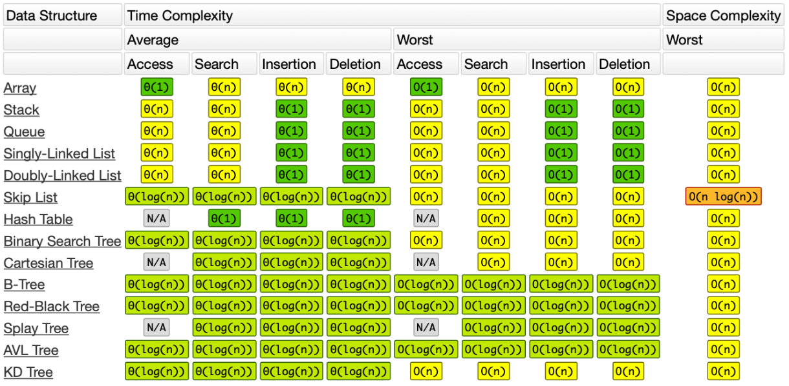

Readme File
===========

Official Big-O Cheat Sheet
------------------------------

Solutions list 
---------------------

.. csv-table:: `Leetcode Solutions <https://leetcode.com/qazqazqaz850/>`_
    :header-rows: 1
    :stub-columns: 0

    #, Title, Level, Time, Space Note, Tags
    1, :func:`~leetcode.impl.solution.Solution.twoSum`, Easy, O(N), O(N), Hashtable
    168, :func:`~leetcode.impl.solution.Solution.convertToTitle`, Medium, O(log N), O(log N), basic
    10, :func:`~leetcode.impl.solution.Solution.isMatch`, Hard, O(NM), O(NM), Dynamic Programming
    13, :func:`~leetcode.impl.solution.Solution.romanToInt`, Easy, O(N), O(1), Basic
    1239, :func:`~leetcode.impl.solution.Solution.maxLength`, Medium, O(NM), O(NM), DFS
    1192, :func:`~leetcode.impl.solution.Solution.criticalConnections`, Hard, , , DFS
    565, :func:`~leetcode.impl.solution.Solution.arrayNesting`, Medium, , , Basic
    162, :func:`~leetcode.impl.solution.Solution.findPeakElement`, Medium, O(log N) , , Binary Search
    657, :func:`~leetcode.impl.solution.Solution.judgeCircle`, Easy, O(N) , O(N), Basic
    1048, :func:`~leetcode.impl.solution.Solution.longestStrChain`, Medium, , , Stack
    3, :func:`~leetcode.impl.solution.Solution.lengthOfLongestSubstring`, Medium, , , Stack
    2260, :func:`~leetcode.impl.solution.Solution.minimumCardPickup`, Medium, , , Hashtable
    547, :func:`~leetcode.impl.solution.Solution.findCircleNum`, Medium, , , DFS
    207, :func:`~leetcode.impl.solution.Solution.canFinish`, Medium, , , DFS
    300, :func:`~leetcode.impl.solution.Solution.lengthOfLIS`, Medium, , , Dynamic Programming
    64, :func:`~leetcode.impl.solution.Solution.minPathSum`, Medium, , , DFS
    34, :func:`~leetcode.impl.solution.Solution.searchRange`, Medium, , , Stack
    53, :func:`~leetcode.impl.solution.Solution.maxSubArray`, Easy, , , Basic
    71, :func:`~leetcode.impl.solution.Solution.simplifyPath`, Medium, , , Stack
    78, :func:`~leetcode.impl.solution.Solution.subsets`, Medium, , , Backtracking
    91, :func:`~leetcode.impl.solution.Solution.numDecodings`, Medium, , , Dynamic Programming
    1763, :func:`~leetcode.impl.solution.Solution.longestNiceSubstring`, Easy, , , DFS
    217, :func:`~leetcode.impl.solution.Solution.containDuplicate`, Easy, , , Hashtable
    283, :func:`~leetcode.impl.solution.Solution.moveZeroes`, Easy, , , Fast and Slow Pointers
    36, :func:`~leetcode.impl.solution.Solution.isValidSudoku`, Medium, , , BFS
    1704, :func:`~leetcode.impl.solution.Solution.halvesAreAlike`, Easy, , , Two Pointers
    122, :func:`~leetcode.impl.solution.Solution.maxProfitII`, Medium, , , Basic
    121, :func:`~leetcode.impl.solution.Solution.maxProfit`, Easy, , , Dynamic Programming
    714, :func:`~leetcode.impl.solution.Solution.maxProfitwithfee`, Medium, , , Dynamic Programming
    944, :func:`~leetcode.impl.solution.Solution.minDeletionSize`, Easy, , , Basic
    44, :func:`~leetcode.impl.solution.Solution.WildcardisMatch`, Hard, , , Dynamic Programming
    2280, :func:`~leetcode.impl.solution.Solution.minimumLines`, Medium, , , Basic
    496, :func:`~leetcode.impl.solution.Solution.nextGreaterElement`, Easy, , , Stack
    503, :func:`~leetcode.impl.solution.Solution.nextGreaterElementsII`, Medium, , , Stack
    739, :func:`~leetcode.impl.solution.Solution.dailyTemperatures`, Medium, , , Stack
    2281, :func:`~leetcode.impl.solution.Solution.totalStrength`, Hard, , , Stack

.. mdinclude:: ../../README.md

